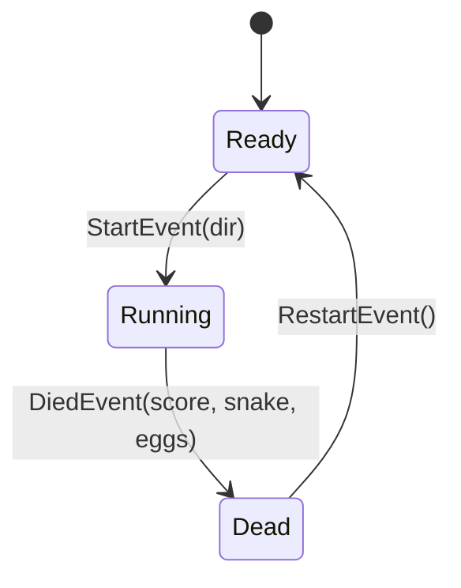

# Snake × State Machine Refactoring Example

**English** | [繁體中文](README.zh-TW.md)

This repo is a working example of [pinioncore-stateful-class-design](https://github.com/jiowchern/pinioncore-stateful-class-design) — an event-driven state machine pattern.
It takes a single-file HTML5 Canvas snake game and refactors it from "one `state` string variable + if-branches scattered everywhere" into "state classes + event-driven transitions".

The whole game is one file, [index.html](index.html). Behavior is identical before and after — only the structure changed.

## How to Run

Open `index.html` directly in a browser, or serve it locally:

```bash
npx -y http-server -c-1
```

Arrow keys / WASD to move, Enter to restart.

## The Smell Before Refactoring

The original version managed its mode with a string variable:

```js
let state; // "ready" | "running" | "dead"
```

This hits the **iron rule** for state machine refactoring — the same variable is **both branched on and assigned** inside a continuously-called method (the rAF loop):

| Location | Behavior |
|---|---|
| `loop()` | Branches on `state === "running"` every frame, plus a defensive re-check inside the while loop |
| `die()` | Assigns `state = "dead"` within the `loop → step → die` call chain |
| keydown handler | Input logic for all three states crammed together, split by ifs, assigning `state = "running"` |
| `reset()` | Assigns `state = "ready"` and manually zeroes nine globals one by one |

Transition rules were scattered across three places. Data that only makes sense while running (snake, direction queue, accumulator…) lived at global scope — forgetting to reset any one of them is a stale-field bug.

## The Structure After



Four layers, all inside the `<script>` of `index.html`:

1. **State machine core** — `StateMachine` only performs the handover: `Change(next)` = old state `Disable()` → swap → new state `Enable()`. Under 20 lines.
2. **Three state classes** — each owns its own data and input listeners:
   - `ReadyState`: shows the start overlay, draws the initial board; a direction key → raises `StartEvent(dir)`.
   - `RunningState`: snake, eggs, direction queue, score, speed, and step accumulator are **all initialized in the constructor**; `Update(dt)` steps and draws; death → raises `DiedEvent`, HUD changes → raise `HudEvent`.
   - `DeadState`: shows the game-over overlay, freezes the final board; Enter → raises `RestartEvent`.
3. **Owner (`Game`)** — holds the raw materials (best-score record, the rAF loop); the three assembly factories `_toReady / _toRunning / _toDead` **are the entire transition table**. States know nothing about each other; transition payloads (initial direction, final board, score) travel as event arguments.
4. **Stateless utilities** — pure functions like `drawBoard` and `spawnEggs`, called by each state with its own data.

## Design Rules Applied

- **Operations and data live on state classes, not on the owner.** The direction queue exists only inside `RunningState`; "calling the wrong operation in the wrong state" becomes structurally impossible.
- **Transitions are event-driven.** A state doesn't know what the next state is — it only raises events; the owner wires them up in `_toXxx` and decides where to go. Transition *detection* happens inside the state's own `Update`; the owner never polls.
- **A fresh instance per transition.** The constructor guarantees clean initial values, the entire `reset()` function disappears, and the stale-field bug class is eliminated at the root.
- **Input callbacks only write data; events fire only from `Update`.** keydown just sets a flag or pushes to a queue, so transitions always happen on the main loop's synchronous timeline. Once a state is Disabled its `Update` is never called again, so late input is absorbed naturally.
- **Each state attaches/detaches its own listeners in `Enable`/`Disable`.** The three-way if-split in the original keydown handler simply vanishes.

## Before / After

| | Before | After |
|---|---|---|
| Mode representation | `state` string + scattered ifs | Three state classes |
| Transition rules | Spread across `loop`/`die`/keydown | Centralized in the `_toXxx` transition table |
| State-private data | Nine globals + manual `reset()` | Constructor-initialized, reborn on every transition |
| Input handling | One handler, three-way split | Each state manages its own listeners |
| Illegal operations | Guarded by runtime checks | Unrepresentable by structure |

## Links

- The skill itself: [jiowchern/pinioncore-stateful-class-design](https://github.com/jiowchern/pinioncore-stateful-class-design)
- C# reference implementation on NuGet: [PinionCyber.StateManagement](https://www.nuget.org/packages/PinionCyber.StateManagement)
