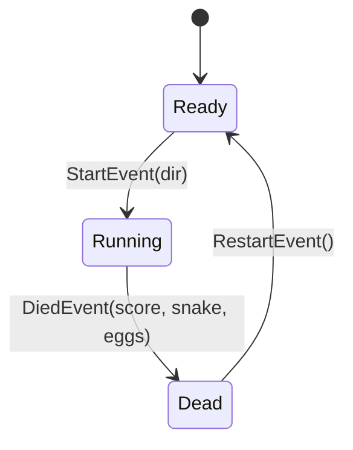

# 貪吃蛇 × 狀態機重構範例

[English](README.md) | **繁體中文**

**▶ [線上直接玩](https://jiowchern.github.io/snake-game/)**——免安裝,瀏覽器直接跑。

這個 repo 是 [pinioncore-stateful-class-design](https://github.com/jiowchern/pinioncore-stateful-class-design)（事件驅動狀態機模式）的實戰範例：
把一個單檔 HTML5 Canvas 貪吃蛇，從「一個 `state` 字串變數 + 散落各處的 if 分支」重構成「狀態類別 + 事件驅動轉移」。

整個遊戲只有一個檔案 [index.html](index.html)，重構前後行為完全相同——差別在結構。

## 執行方式

直接用瀏覽器開啟 `index.html`，或起一個本地靜態伺服器：

```bash
npx -y http-server -c-1
```

方向鍵 / WASD 移動，Enter 重新開始。

## 重構前的病徵

原始版本用一個字串變數管理模式：

```js
let state; // "ready" | "running" | "dead"
```

它命中了狀態機重構的**鐵律**——同一個變數在持續呼叫的方法（rAF 迴圈）裡**既被分支又被賦值**：

| 位置 | 行為 |
|---|---|
| `loop()` | 每幀分支 `state === "running"`，while 迴圈裡還要防禦性重查 |
| `die()` | 在 `loop → step → die` 呼叫鏈內賦值 `state = "dead"` |
| keydown handler | 三個狀態的輸入邏輯擠在一起，靠 if 分流，並賦值 `state = "running"` |
| `reset()` | 賦值 `state = "ready"`，並手動逐一歸零九個全域變數 |

轉移規則散落在三個地方；Running 才有意義的資料（蛇、方向佇列、累加器⋯）躺在全域，漏 reset 任何一個就是 stale-field bug。

## 重構後的結構



四層結構，全部在 `index.html` 的 `<script>` 裡：

1. **狀態機核心** — `StateMachine` 只做交接：`Change(next)` = 舊狀態 `Disable()` → 換手 → 新狀態 `Enable()`。不到 20 行。
2. **三個狀態類別** — 各自持有自己的資料與輸入監聽：
   - `ReadyState`:顯示開始畫面、畫初始盤面;方向鍵 → 發 `StartEvent(dir)`。
   - `RunningState`:蛇、蛋、方向佇列、分數、速度、步進累加器**全部收進建構子**;`Update(dt)` 做步進與繪製;死亡 → 發 `DiedEvent`,HUD 變化 → 發 `HudEvent`。
   - `DeadState`:顯示結算、凍結最後盤面;Enter → 發 `RestartEvent`。
3. **Owner(`Game`)** — 持有原料(最高分紀錄、rAF 迴圈)；`_toReady / _toRunning / _toDead` 三個組裝工廠**就是唯一的轉移表**。狀態彼此不知道對方存在，轉移酬載(初始方向、最終盤面、分數)走事件參數。
4. **無狀態工具** — `drawBoard`、`spawnEggs` 等純函式，由各狀態帶自己的資料呼叫。

## 套用的設計規則

- **操作與資料放在狀態類別上，不放在 owner 上。** 方向佇列只存在於 `RunningState`；「在錯的狀態呼叫錯的操作」在結構上不可能發生。
- **轉移是事件驅動的。** 狀態不知道下一個狀態是誰，只發事件；owner 在 `_toXxx` 裡接線並決定去向。轉移*偵測*在狀態自己的 `Update` 裡發生，owner 從不輪詢。
- **每次轉移 new 新實例。** 建構子保證初值乾淨，`reset()` 整個函式消失，stale-field 這類 bug 從根源被消滅。
- **輸入回呼只寫資料，事件一律從 `Update` 發出。** keydown 只設旗標或推佇列，轉移永遠發生在主迴圈的同步時間軸上；狀態被 `Disable` 後 `Update` 不再被呼叫，遲到的輸入自然被吸收。
- **各狀態在 `Enable`/`Disable` 自行掛拆監聽。** 原本 keydown 裡的三路 if 分流直接消失。

## 對照

| | 重構前 | 重構後 |
|---|---|---|
| 模式表示 | `state` 字串 + 散落的 if | 三個狀態類別 |
| 轉移規則 | 散在 `loop`/`die`/keydown 三處 | 集中在 `_toXxx` 轉移表 |
| 狀態私有資料 | 九個全域變數 + 手動 `reset()` | 建構子初始化，轉移即重生 |
| 輸入處理 | 一個 handler 三路分流 | 各狀態自掛自拆監聽 |
| 非法操作 | 靠執行期檢查防守 | 結構上不可表示 |

## 相關連結

- Skill 本體：[jiowchern/pinioncore-stateful-class-design](https://github.com/jiowchern/pinioncore-stateful-class-design)
- C# 參考實作 NuGet 套件：[PinionCyber.StateManagement](https://www.nuget.org/packages/PinionCyber.StateManagement)
